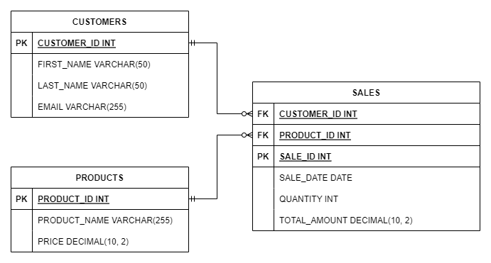

# Technical Test instructions
## Snowflake login
- URL 
    - https://fu08711.east-us-2.azure.snowflakecomputing.com
- Username and password to be sent in a secure email
- Default role: TECHNICAL_TESTER

## Snowflake environment
- There is a single database you will have access to. Within this database there are two schemas. SALES_MART and STAGE. SALES_MART is read-only. If you need to write data you are able to do so within the STAGE schema.

## Database diagram

## Technical test
### Background information on the data
This dataset represents a fictional company, E-Corp. E-Corp is a electronics company that sells products to businesses. They sell 13 different products to their 25 customers. The sales table contains sales data from January 2022 through November 2023. The team has not implemented any price changes in the last 2 years, introduced no new products, or added any new customers.

1. Perfrom a exploratory data analysis on the existing dataset. Please list your findings along with the code showcasing your results. Please use SQL or a Jupyter notebook. Limit the commentary here to no more than 5 bullet points.
2. Generate and execute the DDL required to create a view that joins all 3 tables together. Please provide the DDL as your solution.
3. Determine the number 4 ranked products based on total sales by year. Please provide SQL statement that returns your answer.
    - Based on the answer from number 3, based on the product costs in the table please determine which of the two products is more profitable. Provide an answer using a SQL statement.

        | Item | Cost |
        | ---- | ---- |
        | 2022 Product | 450 |
        | 2023 Product | 375 |
4. The marketing team wants to segment customers based on their total revenue. How would you identify high-value customers who have generated more revenue than the average customer? Provide an answer using a SQL statement.
5. For each product, calculate its percentage contribution to the total revenue. Provide an answer using a SQL statement.

## Uploading your solutions
When you are done providing solutions, please push to our repo for review. We will review internally before the next scheduled interview.

Repo: xyz.devops.com
Dir: technical-test/candidate1